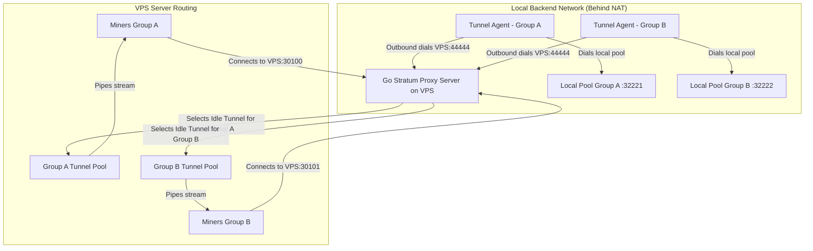

# Go Stratum TCP Tunnel Proxy

A high-performance, zero-dependency, reverse-tunneling Stratum TCP Proxy written in Go. 

This architecture allows a local mining pool backend situated behind a NAT or firewall to connect outbound to a public VPS (static IP). The VPS acts as the **Tunnel Server** (routing miner connections) and the local pool runs the **Tunnel Agent** (maintaining the pools of tunnel streams).

### Key Architectural Benefits
1. **Bypasses NAT/Firewalls**: The Agent dials outbound to the VPS. No ports need to be forwarded on your local network.
2. **No Dynamic IP Updating Needed**: Since the Agent initiates the connection, the VPS does not need to know the backend's IP. If your local ISP reconnects and changes your dynamic IP, the agent simply reconnects to the VPS automatically.
3. **Dedicated Port-to-Group Static Mapping**: The proxy operates strictly on dedicated miner ports. Miner connections on these ports map directly to their corresponding tunnel groups, ensuring zero packet-splitting delays or dynamic payload-scanning.
4. **FIFO Connection Allocation**: To ensure stratum stream stability, idle connections are popped in First-In, First-Out (FIFO) order.

---

## Architectural Flow



---

## Configuration

### 1. Server Configuration (`/etc/stratum-proxy/backends.json`)
Placed on the VPS. It configures the port for agents, security settings, and static routing group listener mappings:

```json
{
  "tunnel_listen": "0.0.0.0:44444",
  "secret_token": "a_very_long_secure_shared_token_string",
  "tls_cert": "/etc/stratum-proxy/cert.pem",
  "tls_key": "/etc/stratum-proxy/key.pem",
  "max_connections": 10000,
  "groups": [
    {
      "name": "group_scrypt",
      "listen": "0.0.0.0:30100"
    },
    {
      "name": "group_neng_lowdiff",
      "listen": "0.0.0.0:30101"
    }
  ]
}
```

### 2. Agent Configuration (`/etc/stratum-agent/agent.json`)
Placed on the local mining pool machine. It establishes tunnel pools matching coin groups, mapping them to the local backend port:

```json
{
  "server": "vps_public_ip:44444",
  "pool_size": 5,
  "secret_token": "a_very_long_secure_shared_token_string",
  "tls": true,
  "tls_skip_verify": true,
  "mappings": [
    {
      "group": "group_scrypt",
      "local": "127.0.0.1:32221"
    },
    {
      "group": "group_neng_lowdiff",
      "local": "127.0.0.1:32222"
    }
  ]
}
```

---

## Security & Encryption (Optional TLS & Token Auth)

To protect your tunnel connections from unauthorized agents and eavesdropping, the proxy features a secure authentication and encryption layer:

1. **Pre-Shared Token Authentication**: Only authorized Agents that present the configured `secret_token` can register tunnels with the VPS. The server immediately closes connections with missing or invalid tokens.
2. **Dynamic TLS Detection (Optional)**: TLS is optional.
   - **On the Agent**: If `"tls": true` is specified in `agent.json`, the agent initiates a TLS connection to wrap all tunnel traffic. If `"tls": false` (or omitted), it connects using raw TCP (passing raw data).
   - **On the VPS Server**: If `tls_cert` and `tls_key` are specified in `backends.json`, the server supports TLS dynamically on the *same* tunnel port. It inspects the first byte of incoming connections. If a TLS handshake is detected (first byte is `0x16`), it negotiates TLS; if not, it falls back to raw TCP.

### Generating a Self-Signed TLS Certificate

For ease of deployment, you can generate a self-signed certificate directly on the VPS to use for the tunnel encryption:

```bash
# Generate a self-signed certificate and private key valid for 10 years (3650 days)
sudo openssl req -x509 -newkey rsa:4096 -nodes -keyout /etc/stratum-proxy/key.pem -out /etc/stratum-proxy/cert.pem -sha256 -days 3650 -subj "/CN=stratum-proxy"
```

Once generated, make sure to point the `tls_cert` and `tls_key` fields in `backends.json` to these paths, and set `"tls": true` in `agent.json`.

---

## Compilation & Verification

### Run Automated Tests
Verifies proxy routing, dynamic agent reconnects, FIFO selection, authentication, connection limits, and panic recovery:

```bash
/usr/local/go/bin/go test -v ./...
```

### Building Binaries
For simplicity, you can use the helper script `./build.sh` to compile your binaries:

1. **Build for your current system**:
   ```bash
   ./build.sh
   # Binaries will be built in: build/bin/
   ```

2. **Cross-compile for all targets (Linux AMD64 and ARM64)**:
   ```bash
   ./build.sh all
   # Binaries will be built in: build/linux-amd64/ and build/linux-arm64/
   ```

3. **Clean up build artifacts**:
   ```bash
   ./build.sh clean
   ```

---

## How Dedicated Port FIFO Mapping Works

1. **FIFO Pool Mapping**: The Agent maintains a constant pool of `pool_size` idle connections to the VPS. Inside the VPS, these connections are sorted by registration time (FIFO). When a miner connects, the VPS selects the oldest idle connection in the pool. This minimizes connection cycling.
2. **Dedicated Port Constraints**: There is no universal port scanning stratum packets. Dedicated ports map strictly to one group. This guarantees that miners connecting on a port are directly piped to the specific local backend pool registered under that group, eliminating any packet routing errors.
