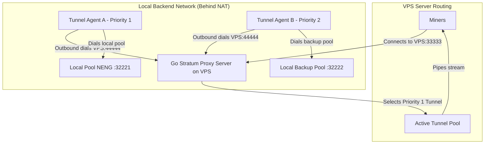

# Go Stratum TCP Tunnel Proxy

A high-performance, zero-dependency, reverse-tunneling Stratum TCP Proxy written in Go. 

This architecture allows a local mining pool backend situated behind a NAT or firewall to connect outbound to a public VPS (static IP). The VPS acts as the **Tunnel Server** (routing miner connections) and the local pool runs the **Tunnel Agent** (maintaining the pools of tunnel streams).

### Key Architectural Benefits
1. **Bypasses NAT/Firewalls**: The Agent dials outbound to the VPS. No ports need to be forwarded on your local network.
2. **No Dynamic IP Updating Needed**: Since the Agent initiates the connection, the VPS does not need to know the backend's IP. If your local ISP reconnects and changes your dynamic IP, the agent simply reconnects to the VPS automatically.
3. **Primary-Backup High Availability**: Tunnels register with a priority level (e.g. `1` for primary, `2` for backup). The VPS always routes incoming miner connections to the highest priority idle tunnel available.
4. **FIFO Connection Allocation**: To ensure stratum stream stability, idle connections are popped in First-In, First-Out (FIFO) order.

---

## Architectural Flow



---

## Configuration

### 1. Server Configuration (`/etc/stratum-proxy/backends.json`)
Placed on the VPS. It configures the port for miners and the port for the agents to connect:

```json
{
  "listen": "0.0.0.0:33333",
  "tunnel_listen": "0.0.0.0:44444",
  "default_group": "group_neng",
  "groups": [
    {
      "name": "group_neng",
      "coins": ["NENG", "NXE", "MTBC"]
    },
    {
      "name": "group_nxe",
      "coins": ["BTG", "BTB", "XXX"]
    }
  ]
}
```

### 2. Agent Configuration (`/etc/stratum-agent/agent.json`)
Placed on the local mining pool machine. It establishes tunnel pools matching coin groups:

```json
{
  "server": "vps_public_ip:44444",
  "pool_size": 5,
  "mappings": [
    {
      "group": "group_neng",
      "priority": 1,
      "local": "127.0.0.1:32221"
    },
    {
      "group": "group_nxe",
      "priority": 1,
      "local": "127.0.0.1:32222"
    }
  ]
}
```

---

## Compilation & Verification

### Run Automated Tests
Verifies proxy routing, priority-routing, dynamic agent reconnects, failovers, and FIFO selection:

```bash
/usr/local/go/bin/go test -v ./...
```

### Compile Server Binary (for VPS)
```bash
env GOOS=linux GOARCH=amd64 /usr/local/go/bin/go build -ldflags="-s -w" -o stratum-proxy main.go
```

### Compile Agent Binary (for Local Backend)
```bash
env GOOS=linux GOARCH=amd64 /usr/local/go/bin/go build -ldflags="-s -w" -o stratum-agent agent/main.go
```

---

## Deployment

### A. VPS Setup (Tunnel Server)

1. **Directories & Configuration**:
   ```bash
   sudo mkdir -p /etc/stratum-proxy
   sudo cp backends.json /etc/stratum-proxy/
   ```

2. **Binary Installation**:
   ```bash
   sudo cp stratum-proxy /usr/local/bin/
   sudo chmod +x /usr/local/bin/stratum-proxy
   ```

3. **Systemd Service Setup**:
   ```bash
   sudo cp stratum-proxy.service /etc/systemd/system/
   sudo systemctl daemon-reload
   sudo systemctl enable stratum-proxy
   sudo systemctl start stratum-proxy
   ```

4. **Monitor Server Logs**:
   ```bash
   sudo journalctl -u stratum-proxy -f -n 100
   ```

---

### B. Local Backend Setup (Tunnel Agent)

1. **Directories & Configuration**:
   ```bash
   sudo mkdir -p /etc/stratum-agent
   sudo cp agent/agent.json /etc/stratum-agent/agent.json
   ```

2. **Binary Installation**:
   ```bash
   sudo cp stratum-agent /usr/local/bin/
   sudo chmod +x /usr/local/bin/stratum-agent
   ```

3. **Systemd Service Setup**:
   ```bash
   sudo cp stratum-agent.service /etc/systemd/system/
   sudo systemctl daemon-reload
   sudo systemctl enable stratum-agent
   sudo systemctl start stratum-agent
   ```

4. **Monitor Agent Logs**:
   ```bash
   sudo journalctl -u stratum-agent -f -n 100
   ```

---

## How Priority and FIFO Logic Works

1. **FIFO Pool Mapping**: The Agent maintains a constant pool of `pool_size` idle connections to the VPS. Inside the VPS, these connections are sorted by registration time (FIFO). When a miner connects, the VPS selects the oldest idle connection in the pool. This minimizes connection cycling.
2. **Failover Priority**: If you run a Primary Agent (with `"priority": 1` in its `agent.json`) and a Backup Agent (with `"priority": 2` in its `agent.json`), the VPS always pops from the Priority 1 pool.
3. **Seamless Failover & Fallback**: If the Primary Agent crashes or its network drops, the VPS automatically pops from the Priority 2 pool. Once the Primary Agent reconnects and registers its Priority 1 tunnels, the VPS immediately routes new connections to it without interrupting existing streams on the Backup Agent.
