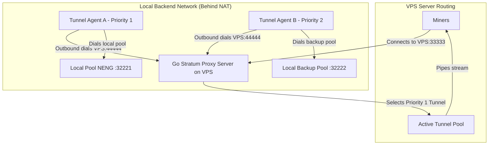

# Go Stratum TCP Tunnel Proxy

A high-performance, zero-dependency, reverse-tunneling Stratum TCP Proxy written in Go. 

This architecture allows a local mining pool backend situated behind a NAT or firewall to connect outbound to a public VPS (static IP). The VPS acts as the **Tunnel Server** (routing miner connections) and the local pool runs the **Tunnel Agent** (maintaining the pools of tunnel streams).

### Key Architectural Benefits
1. **Bypasses NAT/Firewalls**: The Agent dials outbound to the VPS. No ports need to be forwarded on your local network.
2. **No Dynamic IP Updating Needed**: Since the Agent initiates the connection, the VPS does not need to know the backend's IP. If your local ISP reconnects and changes your dynamic IP, the agent simply reconnects to the VPS automatically.
3. **Primary-Backup High Availability**: Tunnels register with a priority level (e.g. `1` for primary, `2` for backup). The VPS always routes incoming miner connections to the highest priority idle tunnel available.
4. **FIFO Connection Allocation**: To ensure stratum stream stability, idle connections are popped in First-In, First-Out (FIFO) order.

---

## Architectural Flow



---

## Configuration

### 1. Server Configuration (`/etc/stratum-proxy/backends.json`)
Placed on the VPS. It configures the port for miners, the port for the agents, security settings, and coin routing groups:

```json
{
  "listen": "0.0.0.0:33333",
  "tunnel_listen": "0.0.0.0:44444",
  "default_group": "group_neng",
  "failback_cooldown": "8h",
  "secret_token": "a_very_long_secure_shared_token_string",
  "tls_cert": "/etc/stratum-proxy/cert.pem",
  "tls_key": "/etc/stratum-proxy/key.pem",
  "groups": [
    {
      "name": "group_neng",
      "coins": ["NENG", "NXE", "MTBC"],
      "static_mapping": false
    },
    {
      "name": "group_nxe",
      "coins": ["BTG", "BTB", "XXX"],
      "static_mapping": true
    }
  ]
}
```

### 2. Agent Configuration (`/etc/stratum-agent/agent.json`)
Placed on the local mining pool machine. It establishes tunnel pools matching coin groups, and controls whether to connect securely over TLS:

```json
{
  "server": "vps_public_ip:44444",
  "pool_size": 5,
  "secret_token": "a_very_long_secure_shared_token_string",
  "tls": true,
  "tls_skip_verify": true,
  "mappings": [
    {
      "group": "group_neng",
      "priority": 1,
      "local": "127.0.0.1:32221"
    },
    {
      "group": "group_nxe",
      "priority": 1,
      "local": "127.0.0.1:32222"
    }
  ]
}
```

---

## Security & Encryption (Optional TLS & Token Auth)

To protect your tunnel connections from unauthorized agents and eavesdropping, the proxy features a secure authentication and encryption layer:

1. **Pre-Shared Token Authentication**: Only authorized Agents that present the configured `secret_token` can register tunnels with the VPS. The server immediately closes connections with missing or invalid tokens.
2. **Dynamic TLS Detection (Optional)**: TLS is optional.
   - **On the Agent**: If `"tls": true` is specified in `agent.json`, the agent initiates a TLS connection to wrap all tunnel traffic. If `"tls": false` (or omitted), it connects using raw TCP (passing raw data).
   - **On the VPS Server**: If `tls_cert` and `tls_key` are specified in `backends.json`, the server supports TLS dynamically on the *same* tunnel port. It inspects the first byte of incoming connections. If a TLS handshake is detected (first byte is `0x16`), it negotiates TLS; if not, it falls back to raw TCP.

### Generating a Self-Signed TLS Certificate

For ease of deployment, you can generate a self-signed certificate directly on the VPS to use for the tunnel encryption:

```bash
# Generate a self-signed certificate and private key valid for 10 years (3650 days)
sudo openssl req -x509 -newkey rsa:4096 -nodes -keyout /etc/stratum-proxy/key.pem -out /etc/stratum-proxy/cert.pem -sha256 -days 3650 -subj "/CN=stratum-proxy"
```

Once generated, make sure to point the `tls_cert` and `tls_key` fields in `backends.json` to these paths, and set `"tls": true` in `agent.json`.

---

## Compilation & Verification

### Run Automated Tests
Verifies proxy routing, priority-routing, dynamic agent reconnects, failovers, and FIFO selection:

```bash
/usr/local/go/bin/go test -v ./...
```

### Compile Server Binary (for VPS)
```bash
env GOOS=linux GOARCH=amd64 /usr/local/go/bin/go build -ldflags="-s -w" -o stratum-proxy main.go
```

### Compile Agent Binary (for Local Backend)
```bash
env GOOS=linux GOARCH=amd64 /usr/local/go/bin/go build -ldflags="-s -w" -o stratum-agent agent/main.go
```

---

## Deployment

### A. VPS Setup (Tunnel Server)

1. **Directories & Configuration**:
   ```bash
   sudo mkdir -p /etc/stratum-proxy
   sudo cp backends.json /etc/stratum-proxy/
   ```

2. **Binary Installation**:
   ```bash
   sudo cp stratum-proxy /usr/local/bin/
   sudo chmod +x /usr/local/bin/stratum-proxy
   ```

3. **Systemd Service Setup**:
   ```bash
   sudo cp stratum-proxy.service /etc/systemd/system/
   sudo systemctl daemon-reload
   sudo systemctl enable stratum-proxy
   sudo systemctl start stratum-proxy
   ```

4. **Monitor Server Logs**:
   ```bash
   sudo journalctl -u stratum-proxy -f -n 100
   ```

---

### B. Local Backend Setup (Tunnel Agent)

1. **Directories & Configuration**:
   ```bash
   sudo mkdir -p /etc/stratum-agent
   sudo cp agent/agent.json /etc/stratum-agent/agent.json
   ```

2. **Binary Installation**:
   ```bash
   sudo cp stratum-agent /usr/local/bin/
   sudo chmod +x /usr/local/bin/stratum-agent
   ```

3. **Systemd Service Setup**:
   ```bash
   sudo cp stratum-agent.service /etc/systemd/system/
   sudo systemctl daemon-reload
   sudo systemctl enable stratum-agent
   sudo systemctl start stratum-agent
   ```

4. **Monitor Agent Logs**:
   ```bash
   sudo journalctl -u stratum-agent -f -n 100
   ```

---

## How Priority, FIFO, and Failback Cooldown Works

1. **FIFO Pool Mapping**: The Agent maintains a constant pool of `pool_size` idle connections to the VPS. Inside the VPS, these connections are sorted by registration time (FIFO). When a miner connects, the VPS selects the oldest idle connection in the pool. This minimizes connection cycling.
2. **Failover Priority**: If you run a Primary Agent (with `"priority": 1` in its `agent.json`) and a Backup Agent (with `"priority": 2` in its `agent.json`), the VPS always pops from the Priority 1 pool.
3. **Failback Cooldown**: If the Primary Agent (Priority 1) goes offline, the VPS automatically routes new connections to the Backup Agent (Priority 2), triggering a **failback cooldown** (configured via `"failback_cooldown"`, e.g. `"8h"`). 
4. **Cooldown Hold**: During the cooldown period (default: 8 hours), even if the Primary Agent comes back online, all new connections will **continue to route to the Backup Agent**. This prevents stratum miners from constantly jumping or cutting off.
5. **Fail-safe Logic**: If the Backup Agent goes offline during the cooldown period, the server temporarily bypasses the cooldown lock to route new connections to the Primary Agent, keeping miners online.
6. **Auto-Recovery**: Once the cooldown duration expires, new connections will naturally fall back to the Primary Agent (Priority 1) again.
7. **Static Mapping**: If `"static_mapping": true` is configured on a coin group, automatic failover is completely disabled. Miner connections will strictly route to the Primary Agent (Priority 1). If the Primary Agent is offline, the connection will fail immediately and will NOT fall back to Priority 2. This is useful when the backup stratum backend does not support the same coins as the primary backend.
